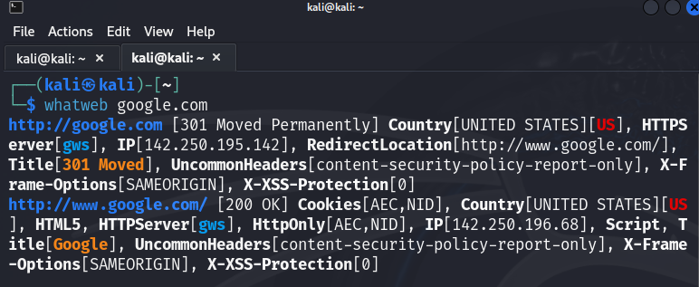

# InformationGathering
Information Gathering Techiques

# To perform information gathering techniques

# AIM:

To perform information gathering techniques using kali linux 

## STEPS:

### Step 1:

Install kali linux either in partition or virtual box or in live mode

### Step 2:

Investigate on the various categories of tools as follows:

### Step 3:
Open terminal/browser and try execute necessary commands/use url to perform information gathering

## OUTPUT:
WHOIS:

IP2LOCATION:

WEB ARCHIVE:

PING:

NC:
### OUTPUT

NMAP:

### OUTPUT

WHATWEB:

### OUTPUT

HTTPRINT:

### OUTPUT

TCP TRACEROUTE:

### OUTPUT

UDP TRACEROUTE:

### OUTPUT

ICMP TRACEROUTE:

### OUTPUT

## RESULT:
The information gathering techniques tools/procedure were  identified successfully
